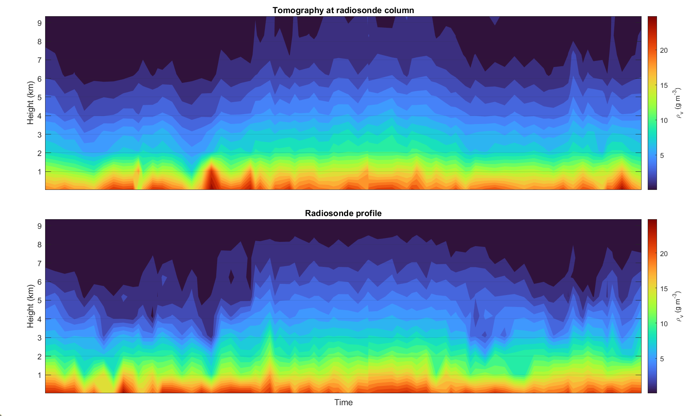

# GVAT - GNSS Water Vapor Tomography r1

## Virtual-ray version

**GVAT** is a research-oriented workflow for **GNSS Water Vapor Tomography**. This `r1` version implements the virtual-ray workflow used to build the tomographic grid, generate virtual slant water vapor observations, assimilate GNSS slant water vapor data, and validate the resulting 3D water vapor density fields against radiosonde profiles.

This repository corresponds to the **virtual-ray version** currently used in the study:

> **3D water vapor signature of tropical storms: GNSS tomography of the 10 most severe rainfall events in Hong Kong 2015-2025**
> submitted to *Journal of Geophysical Research: Atmospheres*.

---

## Overview

The package provides the main workflow for reconstructing the three-dimensional distribution of atmospheric water vapor from GNSS observations. The approach is based on a GNSS tomography framework and includes subsequent developments related to mapping functions, boundary conditions, stochastic modeling, and the use of virtual slant observations.

The workflow includes:

* construction of the tomographic domain and voxel grid;
* generation of station-satellite ray geometry;
* generation of virtual rays/slants;
* assimilation of GNSS slant integrated water vapor observations;
* tomographic inversion of water vapor density;
* validation against radiosonde profiles;
* generation of diagnostic outputs and figures.

---

## Scientific background

This code is based on the GNSS atmospheric water vapor tomography method originally introduced by:

* Miranda, P. M. A., & Mateus, P. (2021).
  *A New Unconstrained Approach to GNSS Atmospheric Water Vapor Tomography*.
  Geophysical Research Letters, 48, e2021GL094852.
  https://doi.org/10.1029/2021GL094852

The present version includes developments and methodological updates discussed in:

* Miranda, P. M. A., & Mateus, P. (2022).
  *Improved GNSS Water Vapor Tomography With Modified Mapping Functions*.
  Geophysical Research Letters.
  https://doi.org/10.1029/2022GL100140

* Miranda, P. M. A., Adams, D. K., Tomé, R., Fernandes, R., & Mateus, P. (2023).
  *Optimizing Boundary Conditions in GNSS Tomography: A Continuous 7-Month Case Study in the Amazon*.
  Geophysical Research Letters.
  https://doi.org/10.1029/2023GL105030

* Mateus, P., Catalão, J., Fernandes, R., & Miranda, P. M. A. (2024).
  *Atmospheric Water Vapor Variability over Houston: Continuous GNSS Tomography in the Year of Hurricane Harvey (2017)*.
  Remote Sensing, 16(17), 3205.
  https://doi.org/10.3390/rs16173205

* Mateus, P., Zhang, M., Catalão, J., & Miranda, P. M. A. (2026).
  *Enhancing the Accuracy of GNSS Tomography with an Empirical Stochastic Model*.
  GPS Solutions.
  https://doi.org/10.1007/s10291-026-02031-x

---

## Repository status

This is a research-code release associated with an ongoing scientific publication. The code is made available to support transparency, reproducibility, and further development of GNSS water vapor tomography methods.

The repository is currently intended for users familiar with:

* GNSS meteorology;
* slant wet delay/slant integrated water vapor processing;
* atmospheric reanalysis data;
* radiosonde validation;
* tomographic inversion methods.

---

## Main features

* GNSS-based water vapor tomography;
* support for virtual slant water vapor observations;
* configurable tomographic domain and voxel resolution;
* terrain-following or height-based grid configuration, depending on the experiment setup;
* integration of observed and virtual slants;
* inversion of 3D water vapor density;
* comparison with radiosonde profiles;
* diagnostic plots and statistical validation.

---

## Input HDF5 file structure

GVAT expects the GNSS slant water vapor observations to be provided in an HDF5 file organized by station. The file contains a global information group, `/information/`, and one individual group for each GNSS station, identified by its 4-character station code.

The expected structure is:

```text
/input_file.h5
│
├── /information/
│   ├── sites      # list of station codes, stored as numeric character codes
│   └── numbers    # station number/index associated with each station
│
├── /<SITE_1>/
│   ├── dt         # observation time matrix, stored as uint64
│   ├── spwv       # slant precipitable water vapor, stored as single precision
│   ├── lon        # station longitude
│   ├── lat        # station latitude
│   ├── alt        # station height
│   └── num        # internal station number/index
|   └── azimuth    # Azimuth angle
|   └── elevation  # Elevation angle
│
├── /<SITE_2>/
│   ├── dt
│   ├── spwv
│   ├── lon
│   ├── lat
│   ├── alt
│   └── num
|   └── azimuth
|   └── elevation 
│
└── ...
```

For each station, the `/dt/` and `/spwv/` datasets must have exactly the same dimensions, so that each slant water vapor value is associated with the corresponding time entry. The `/lon/`, `/lat/`, `/alt/`, and `/num/` datasets are scalar values that define the station position and its internal identifier.

In the file produced by the `saveH5file` script, the main datasets and data types are:

```text
/information/sites      double, dimensions [n_sites, 4]
/information/numbers    double, dimensions [n_sites, 1]

/<SITE>/dt              uint64, dimensions [n, m]
/<SITE>/spwv            single, dimensions [n, m]
/<SITE>/lon             single, scalar
/<SITE>/lat             single, scalar
/<SITE>/alt             single, scalar
/<SITE>/num             single, scalar
/<SITE>/azimuth         single, scalar
/<SITE>/elevation       single, scalar
```

Here, `<SITE>` is the GNSS station code, `n` is the number of observations/epochs, and `m` is the number of columns used by the internal observation format. The station codes are also stored in `/information/sites`, allowing GVAT to automatically loop through all available stations in the HDF5 file.

---

## Requirements

The code requires a scientific MATLAB environment. The exact dependency list should be checked in the repository files.

---

## Quick start

For MATLAB-based execution:

```matlab
run('scripts/GVAT_r1.m')
```
---


## Citation

If you use this code, please cite the original methodological paper:

```text
Miranda, P. M. A., & Mateus, P. (2021).
A New Unconstrained Approach to GNSS Atmospheric Water Vapor Tomography.
Geophysical Research Letters, 48, e2021GL094852.
https://doi.org/10.1029/2021GL094852
```

Please also cite the relevant follow-up papers listed in the **Scientific background** section, depending on which workflow components are used.

---

## Licence

This repository is released under the MIT License. See the `LICENSE` file for details.

---

## Disclaimer

This is research software. Although the code has been used in scientific studies, it is provided without warranty. Users should carefully inspect the configuration files, input data, and assumptions before applying the workflow to new domains or events.

---

## Contact

For questions, please contact:

**Pedro Mateus**
Instituto Dom Luiz / Faculdade de Ciências da Universidade de Lisboa
E-mail: `pjmateus@ciencias.ulisboa.pt`

---
<p align="center">
  
</p>

<p align="center">
  <em>Figure 1. Hovmoller diagram comparing vertical water vapor density profiles from GNSS tomography and radiosondes over Hong Kong. The top panel shows tomographic water vapor density (rho_v) sampled along the radiosonde column, and the bottom panel shows the corresponding radiosonde-derived water vapor density. Both panels use the same color scale, with rho_v in g m^-3, height in km, and time along the x-axis.</em>
</p>
